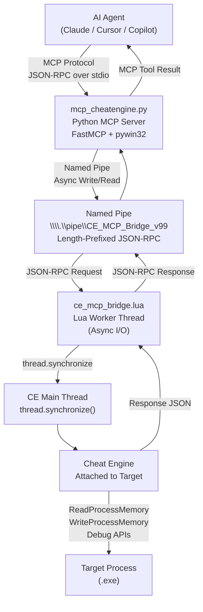

<div align="center">


# Cheat Engine MCP Bridge

**AI-powered reverse engineering and memory analysis via the Model Context Protocol**

43 MCP Tools &middot; Hardware Breakpoints &middot; DBVM Ring -1 Tracing &middot; Named Pipe IPC

[](CHANGELOG.md)
[](https://python.org)
[](https://www.lua.org)
[](LICENSE)
[](#test-suite)
[](https://github.com/sudohakan/cheatengine-mcp-bridge/stargazers)

[Quick Start](#quick-start) &middot; [Features](#features) &middot; [Commands](#commands) &middot; [Architecture](#architecture) &middot; [Contributing](CONTRIBUTING.md)

</div>

---

## Why Cheat Engine MCP Bridge?

> Reverse engineering is manual, tedious, and requires deep domain expertise. What if an AI agent could read process memory, set hardware breakpoints, trace execution at hypervisor level, and analyze structures: all through clean, typed API calls?

Cheat Engine MCP Bridge connects [Cheat Engine](https://www.cheatengine.org/) to AI agents (Claude, Cursor, Copilot, etc.) via the [Model Context Protocol](https://modelcontextprotocol.io/). A Lua script inside Cheat Engine creates a Named Pipe server; a Python MCP server translates tool calls to JSON-RPC commands over that pipe. AI agents never interact with Cheat Engine directly.

| What you get | Details |
|--------------|---------|
| **43 MCP tools** | Memory R/W, pattern scanning, disassembly, breakpoints, DBVM tracing, scripting |
| **Zero GUI interaction** | Everything is API-driven: attach, scan, read, write, trace |
| **Anti-cheat safe** | Hardware breakpoints only (no Int3), DBVM for stealth tracing |
| **32/64-bit universal** | All operations auto-adapt to target process architecture |
| **Auto-reconnect** | Python client reconnects after CE restarts |

> **Platform**: Windows only. Requires Cheat Engine 7.x attached to a target process.

---

## Quick Start

**3 steps to get an AI agent reversing your target process:**

**1.** Load the Lua bridge in Cheat Engine: open `ce_mcp_bridge.lua` via the Lua script editor and run it.

**2.** Add the MCP server to your AI agent config:

```json
{
  "mcpServers": {
    "cheatengine": {
      "command": "python",
      "args": ["C:/path/to/MCP_Server/mcp_cheatengine.py"]
    }
  }
}
```

**3.** Verify the connection:

```
ping() to verify, then get_process_info() to confirm the target.
```

---

## Features

| Feature | Details |
|---------|---------|
| **Memory Reading** | Raw bytes, integers (byte/word/dword/qword/float/double), strings, pointer chains: 32-bit and 64-bit |
| **Memory Writing** | Write integers, raw bytes, ASCII/UTF-16 strings to any writable address |
| **Pattern Scanning** | AOB scan with `??` wildcards, value scan with type filters, next-scan filtering, signature generation |
| **Disassembly** | Disassemble N instructions, instruction info (size, bytes, opcode), function boundary detection |
| **Code Analysis** | Find references, find call sites, analyze function call graph, RTTI class names, structure dissection |
| **Hardware Breakpoints** | Execution and data watchpoints via CPU debug registers (DR0-DR3): anti-cheat safe, max 4 active |
| **DBVM Hypervisor (Ring -1)** | Invisible memory access tracing, virtual-to-physical address translation, operates below OS |
| **Memory Regions** | Enumerate all regions with protection flags, full native region enumeration |
| **Scripting** | Execute arbitrary Lua code and Auto Assembler scripts in CE context (with safety validation) |
| **Auto-Reconnect** | Configurable retry on pipe failure, zombie resource cleanup on CE restart |

---

## Installation

<details>
<summary><strong>Prerequisites</strong></summary>

- Windows 10/11
- [Cheat Engine 7.x](https://www.cheatengine.org/) installed
- Python 3.12+
- A target process attached in Cheat Engine

</details>

<details>
<summary><strong>Python MCP Server Setup</strong></summary>

```bash
cd MCP_Server
pip install -r requirements.txt
```

Dependencies:
- `mcp>=1.0.0`: MCP SDK
- `pywin32>=306`: Windows Named Pipe API

</details>

<details>
<summary><strong>Cheat Engine Lua Bridge Setup</strong></summary>

1. Open Cheat Engine and attach to your target process.
2. Go to **Memory View** > **Tools** > **Lua Script**.
3. Open `MCP_Server/ce_mcp_bridge.lua`.
4. Click **Execute**.
5. The output panel should print `[MCP v11.4.0] Bridge started`.

**Critical setting**: Go to **Settings** > **Extra** > disable **"Query memory region routines"** to prevent BSOD when scanning protected pages.

</details>

<details>
<summary><strong>MCP Client Configuration</strong></summary>

**Claude Desktop** (`claude_desktop_config.json`):
```json
{
  "mcpServers": {
    "cheatengine": {
      "command": "python",
      "args": ["C:\\path\\to\\MCP_Server\\mcp_cheatengine.py"]
    }
  }
}
```

**Claude Code** (`.claude.json`):
```json
{
  "mcpServers": {
    "cheatengine": {
      "command": "python",
      "args": ["C:/path/to/MCP_Server/mcp_cheatengine.py"]
    }
  }
}
```

**Cursor / VS Code** (`.cursor/mcp.json` or MCP settings):
```json
{
  "cheatengine": {
    "command": "python",
    "args": ["/path/to/MCP_Server/mcp_cheatengine.py"]
  }
}
```

</details>

---

## Configuration

| Variable | Default | Description |
|----------|---------|-------------|
| `PIPE_NAME` | `\\.\pipe\CE_MCP_Bridge_v99` | Named Pipe identifier: must match the Lua script |
| `MCP_SERVER_NAME` | `cheatengine` | MCP server name exposed to clients |
| `max_retries` | `2` | Auto-reconnect attempts on pipe failure |

To use a custom pipe name, update both `PIPE_NAME` in `mcp_cheatengine.py` and `PIPE_NAME` in `ce_mcp_bridge.lua`.

---

## Commands

The bridge exposes **43 MCP tools** organized by category. See [AI_Context/MCP_Bridge_Command_Reference.md](AI_Context/MCP_Bridge_Command_Reference.md) for full parameter documentation with examples.

### Process and Modules (6 tools)

| Tool | Description |
|------|-------------|
| `ping()` | Verify bridge connectivity and version |
| `get_process_info()` | Process name, PID, module count, architecture |
| `enum_modules()` | All loaded DLLs with base addresses and sizes |
| `get_thread_list()` | Thread IDs in the target process |
| `get_symbol_address(symbol)` | Resolve symbol name to address |
| `get_address_info(address)` | Reverse lookup: address to symbolic name |

### Memory Read (6 tools)

| Tool | Description |
|------|-------------|
| `read_memory(address, size)` | Raw bytes as hex and array |
| `read_integer(address, type)` | byte / word / dword / qword / float / double |
| `read_string(address, max_length, wide)` | ASCII or UTF-16 strings |
| `read_pointer(address)` | Single pointer dereference (auto 32/64-bit) |
| `read_pointer_chain(base, offsets)` | Multi-level pointer chain with full trace |
| `checksum_memory(address, size)` | MD5 hash of memory region |

### Memory Write (3 tools)

| Tool | Description |
|------|-------------|
| `write_integer(address, value, type)` | Write numeric value |
| `write_memory(address, bytes)` | Write raw byte array |
| `write_string(address, value, wide)` | Write ASCII or UTF-16 string |

### Pattern Scanning (8 tools)

| Tool | Description |
|------|-------------|
| `aob_scan(pattern)` | Array of Bytes scan with `??` wildcards |
| `scan_all(value, type)` | Value-based scan (exact, string, array) |
| `next_scan(value, scan_type)` | Filter: exact, increased, decreased, changed, unchanged |
| `get_scan_results(max)` | Retrieve addresses from last scan |
| `search_string(string, wide)` | Quick text string search in memory |
| `generate_signature(address)` | Create unique AOB to relocate an address |
| `get_memory_regions(max)` | Valid memory regions nearby common bases |
| `enum_memory_regions_full(max)` | All memory regions (native enumeration) |

### Disassembly and Analysis (8 tools)

| Tool | Description |
|------|-------------|
| `disassemble(address, count)` | Disassemble N instructions |
| `get_instruction_info(address)` | Size, bytes, opcode, is_call/jump/ret |
| `find_function_boundaries(address)` | Detect function start and end |
| `analyze_function(address)` | All CALL instructions made by a function |
| `find_references(address)` | Code that references this data address |
| `find_call_references(function_address)` | All callers of a function |
| `dissect_structure(address, size)` | Auto-guess field types at a memory address |
| `get_rtti_classname(address)` | C++ class name from RTTI vtable pointer |

### Hardware Breakpoints (6 tools)

> All breakpoints use hardware debug registers (DR0-DR3). Maximum 4 active at a time. Safe for anti-cheat environments.

| Tool | Description |
|------|-------------|
| `set_breakpoint(address)` | Hardware execution breakpoint: logs registers |
| `set_data_breakpoint(address, access_type)` | Watchpoint: `r`, `w`, or `rw` |
| `get_breakpoint_hits(id, clear)` | Retrieve hit log with register snapshots |
| `remove_breakpoint(id)` | Remove by ID |
| `list_breakpoints()` | All active breakpoints |
| `clear_all_breakpoints()` | Remove all breakpoints |

### DBVM Hypervisor: Ring -1 (4 tools)

> Requires DBVM activated in Cheat Engine settings. Operates below the OS: invisible to anti-cheat.

| Tool | Description |
|------|-------------|
| `get_physical_address(address)` | Virtual to physical address translation |
| `start_dbvm_watch(address, mode)` | Start hypervisor-level memory trace |
| `poll_dbvm_watch(address)` | Read trace results without stopping |
| `stop_dbvm_watch(address)` | Stop trace and return all hits |

### Scripting (2 tools)

| Tool | Description |
|------|-------------|
| `evaluate_lua(code)` | Execute Lua code in Cheat Engine context |
| `auto_assemble(script)` | Run a CE Auto Assembler script |

---

## Architecture



**Communication flow:**
1. AI agent calls an MCP tool. Python MCP server receives the call.
2. Python serializes it as a length-prefixed JSON-RPC request and writes to the Named Pipe.
3. Lua worker thread reads the request and dispatches to the CE main thread via `thread.synchronize`.
4. CE executes the memory operation and returns the result.
5. Response travels back through the same pipe to the Python server, returned as an MCP tool result.

**Why a worker thread?** Blocking pipe I/O on the CE main thread would freeze the GUI. The Lua script uses a dedicated worker thread for all pipe I/O, and `thread.synchronize` ensures CE API calls run safely on the main thread.

**Windows CRLF fix:** The MCP SDK's `stdio_server` outputs CRLF on Windows, breaking JSON-RPC parsing. The Python server monkey-patches the SDK to force LF-only output before any MCP imports.

---

## Project Structure

```
cheatengine-mcp-bridge/
  MCP_Server/
    mcp_cheatengine.py        # Python MCP server (FastMCP, 43 tools)
    ce_mcp_bridge.lua          # Lua bridge for Cheat Engine (v11.4.0, 2333 lines)
    test_mcp.py                # Test suite (36/37 tests passing)
    requirements.txt           # Python dependencies
  AI_Context/
    AI_Guide_MCP_Server_Implementation.md   # Architecture guide for AI agents
    CE_LUA_Documentation.md                 # Cheat Engine Lua API reference
    MCP_Bridge_Command_Reference.md         # Full command docs with examples
  README.md
  CHANGELOG.md
  CONTRIBUTING.md
  SECURITY.md
  CODE_OF_CONDUCT.md
  LICENSE
```

---

## Test Suite

```bash
python MCP_Server/test_mcp.py
```

Results (v11.4.0, requires CE attached with a running process):

```
Memory Reading:  6/6  passed
Process Info:    4/4  passed
Code Analysis:   8/8  passed
Breakpoints:     4/4  passed
DBVM Functions:  3/3  passed (graceful skip if DBVM inactive)
Utility:        11/11 passed
Skipped:         1    (generate_signature: long blocking scan)
-------------------------------------
Total:          36/37 PASSED
```

---

## Contributing

See [CONTRIBUTING.md](CONTRIBUTING.md) for dev setup, code standards, and PR process.

---

## License

MIT: see [LICENSE](LICENSE).

Copyright (c) 2026 [Hakan Topcu](https://github.com/sudohakan)
