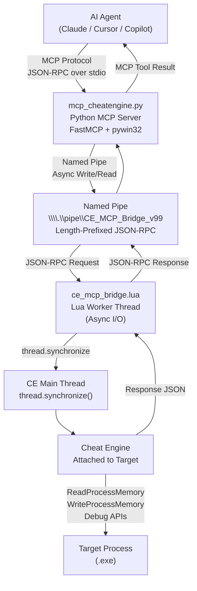

<div align="center">

# 🔬 Cheat Engine MCP Bridge

**AI-powered reverse engineering and memory analysis via the Model Context Protocol**

[](CHANGELOG.md)
[](https://python.org)
[](https://www.lua.org)
[](LICENSE)
[](https://github.com/sudohakan/cheatengine-mcp-bridge/stargazers)

[Quick Start](#quick-start) · [Installation](#installation) · [Commands](#commands) · [Architecture](#architecture) · [Contributing](CONTRIBUTING.md)

</div>

---

## What is this?

Cheat Engine MCP Bridge connects [Cheat Engine](https://www.cheatengine.org/) to AI agents (Claude, Cursor, Copilot, etc.) via the [Model Context Protocol](https://modelcontextprotocol.io/). It exposes 40+ reverse engineering tools — memory reading, disassembly, pattern scanning, hardware breakpoints, and DBVM hypervisor tracing — as MCP tools that AI agents can call directly.

The bridge consists of two components: a Lua script loaded inside Cheat Engine that creates a Named Pipe server, and a Python MCP server that translates MCP tool calls to JSON-RPC commands over that pipe. AI agents never interact with Cheat Engine directly; they call clean, typed MCP tools.

> **Platform**: Windows only. Requires Cheat Engine 7.x attached to a target process.

---

## Features

| Feature | Details |
|---------|---------|
| **Memory Reading** | Raw bytes, integers, strings, pointer chains — 32-bit and 64-bit |
| **Memory Writing** | Write integers, raw bytes, strings to any writable address |
| **Pattern Scanning** | AOB scan with wildcards, value scan, next scan filtering |
| **Disassembly** | Disassemble N instructions, get instruction info, find function boundaries |
| **Code Analysis** | Find references, find call sites, analyze function call graph, RTTI class names |
| **Hardware Breakpoints** | Execution and data watchpoints via CPU debug registers (DR0–DR3) — anti-cheat safe |
| **DBVM Hypervisor (Ring -1)** | Invisible memory access tracing, virtual-to-physical address translation |
| **Structure Analysis** | Auto-dissect memory regions, identify field types and pointer trees |
| **Lua Scripting** | Execute arbitrary Lua code in Cheat Engine's context |
| **Anti-Cheat Safety** | Hardware BPs only (no Int3), DBVM for stealth tracing, safe scan range |
| **32/64-bit Universal** | All operations auto-adapt to target process architecture |
| **Auto-Reconnect** | Python client reconnects to the pipe after CE restarts |

---

## Quick Start

**3 steps to get an AI agent reversing your target process:**

1. **Load the Lua bridge in Cheat Engine** — open `ce_mcp_bridge.lua` via the Lua script editor and run it.
2. **Add the MCP server to your AI agent config** (Claude Desktop, Cursor, etc.):

```json
{
  "mcpServers": {
    "cheatengine": {
      "command": "python",
      "args": ["C:/path/to/MCP_Server/mcp_cheatengine.py"]
    }
  }
}
```

3. **Tell the AI to attach and start reversing:**
```
ping() to verify, then get_process_info() to confirm the target.
```

---

## Installation

<details>
<summary><strong>Prerequisites</strong></summary>

- Windows 10/11
- [Cheat Engine 7.x](https://www.cheatengine.org/) installed
- Python 3.12+
- A target process attached in Cheat Engine

</details>

<details>
<summary><strong>Python MCP Server Setup</strong></summary>

```bash
cd MCP_Server
pip install -r requirements.txt
```

Dependencies:
- `mcp>=1.0.0` — MCP SDK
- `pywin32>=306` — Windows Named Pipe API

</details>

<details>
<summary><strong>Cheat Engine Lua Bridge Setup</strong></summary>

1. Open Cheat Engine and attach to your target process.
2. Go to **Memory View** → **Tools** → **Lua Script**.
3. Open `MCP_Server/ce_mcp_bridge.lua`.
4. Click **Execute**.
5. The output panel should print `[MCP v11.4.0] Bridge started`.

**Critical setting**: Go to **Settings** → **Extra** → disable **"Query memory region routines"** to prevent BSOD when scanning protected pages.

</details>

<details>
<summary><strong>MCP Client Configuration</strong></summary>

**Claude Desktop** (`claude_desktop_config.json`):
```json
{
  "mcpServers": {
    "cheatengine": {
      "command": "python",
      "args": ["C:\\path\\to\\MCP_Server\\mcp_cheatengine.py"]
    }
  }
}
```

**Cursor / VS Code** (`.cursor/mcp.json` or MCP settings):
```json
{
  "cheatengine": {
    "command": "python",
    "args": ["/path/to/MCP_Server/mcp_cheatengine.py"]
  }
}
```

</details>

---

## Configuration

| Variable | Default | Description |
|----------|---------|-------------|
| `PIPE_NAME` | `\\.\pipe\CE_MCP_Bridge_v99` | Named Pipe identifier — must match the Lua script |
| `MCP_SERVER_NAME` | `cheatengine` | MCP server name exposed to clients |
| `max_retries` | `2` | Auto-reconnect attempts on pipe failure |

To use a custom pipe name, update both `PIPE_NAME` in `mcp_cheatengine.py` and `PIPE_NAME` in `ce_mcp_bridge.lua`.

---

## Commands

The bridge exposes **40+ MCP tools** organized by category. Below is a summary — see [AI_Context/MCP_Bridge_Command_Reference.md](AI_Context/MCP_Bridge_Command_Reference.md) for full parameter documentation with examples.

### Basic & Process

| Tool | Description |
|------|-------------|
| `ping()` | Verify bridge connectivity and version |
| `get_process_info()` | Process name, PID, module list, architecture |
| `enum_modules()` | All loaded DLLs with base addresses and sizes |
| `get_thread_list()` | Thread IDs in the target process |
| `get_symbol_address(symbol)` | Resolve symbol name to address |
| `get_address_info(address)` | Reverse lookup: address to symbolic name |

### Memory Read

| Tool | Description |
|------|-------------|
| `read_memory(address, size)` | Raw bytes as hex and array |
| `read_integer(address, type)` | byte / word / dword / qword / float / double |
| `read_string(address, max_length, wide)` | ASCII or UTF-16 strings |
| `read_pointer(address)` | Single pointer dereference (auto 32/64-bit) |
| `read_pointer_chain(base, offsets)` | Multi-level pointer chain with full trace |
| `checksum_memory(address, size)` | MD5 hash of memory region |

### Memory Write

| Tool | Description |
|------|-------------|
| `write_integer(address, value, type)` | Write numeric value |
| `write_memory(address, bytes)` | Write raw byte array |
| `write_string(address, value, wide)` | Write ASCII or UTF-16 string |

### Pattern Scanning

| Tool | Description |
|------|-------------|
| `aob_scan(pattern)` | Array of Bytes scan with `??` wildcards |
| `scan_all(value, type)` | Value-based scan (exact, string, array) |
| `next_scan(value, scan_type)` | Filter scan: exact, increased, decreased, changed |
| `get_scan_results(max)` | Retrieve addresses from last scan |
| `search_string(string, wide)` | Quick text string search in memory |
| `generate_signature(address)` | Create unique AOB to relocate an address |

### Disassembly & Analysis

| Tool | Description |
|------|-------------|
| `disassemble(address, count)` | Disassemble N instructions |
| `get_instruction_info(address)` | Size, bytes, opcode, is_call/jump/ret |
| `find_function_boundaries(address)` | Detect function start and end via prologue/epilogue |
| `analyze_function(address)` | All CALL instructions made by a function |
| `find_references(address)` | Code that references this data address |
| `find_call_references(function_address)` | All callers of a function |
| `dissect_structure(address, size)` | Auto-guess field types at a memory address |
| `get_rtti_classname(address)` | C++ class name from RTTI vtable pointer |

### Breakpoints

> All breakpoints use hardware debug registers (DR0–DR3). Maximum 4 active at a time. Safe for anti-cheat environments.

| Tool | Description |
|------|-------------|
| `set_breakpoint(address)` | Hardware execution breakpoint — logs registers |
| `set_data_breakpoint(address, access_type)` | Watchpoint: `r`, `w`, or `rw` |
| `get_breakpoint_hits(id, clear)` | Retrieve hit log with register snapshots |
| `remove_breakpoint(id)` | Remove by ID |
| `list_breakpoints()` | All active breakpoints |
| `clear_all_breakpoints()` | Remove all breakpoints |

### DBVM Hypervisor (Ring -1)

> Requires DBVM activated in Cheat Engine settings. Operates below the OS — invisible to anti-cheat.

| Tool | Description |
|------|-------------|
| `get_physical_address(address)` | Virtual to physical address translation |
| `start_dbvm_watch(address, mode)` | Start hypervisor-level memory trace |
| `poll_dbvm_watch(address)` | Read trace results without stopping |
| `stop_dbvm_watch(address)` | Stop trace and return all hits |

### Scripting

| Tool | Description |
|------|-------------|
| `evaluate_lua(code)` | Execute Lua code in Cheat Engine's context |
| `auto_assemble(script)` | Run a CE Auto Assembler script |

---

## Architecture



**Communication flow:**
- AI agent calls an MCP tool → Python MCP server receives the call
- Python serializes it as a length-prefixed JSON-RPC request and writes to the Named Pipe
- Lua worker thread reads the request and dispatches it to the CE main thread via `thread.synchronize`
- CE executes the memory operation and returns the result
- Response travels back through the same pipe to the Python server, which returns it as an MCP tool result

**Why a worker thread?** Blocking pipe I/O on the CE main thread would freeze the GUI. The Lua script uses a dedicated worker thread for all pipe I/O, and uses `thread.synchronize` to call CE APIs safely on the main thread.

---

## Project Structure

```
cheatengine-mcp-bridge/
├── MCP_Server/
│   ├── mcp_cheatengine.py      # Python MCP server (FastMCP, 40+ tools)
│   ├── ce_mcp_bridge.lua       # Lua bridge for Cheat Engine (v11.4.0, 2316 lines)
│   ├── test_mcp.py             # Test suite (36/37 tests passing)
│   └── requirements.txt        # Python dependencies
├── AI_Context/
│   ├── AI_Guide_MCP_Server_Implementation.md   # Architecture guide for AI agents
│   ├── CE_LUA_Documentation.md                 # Cheat Engine Lua API reference
│   └── MCP_Bridge_Command_Reference.md         # Full command docs with examples
├── README.md
├── CHANGELOG.md
├── CONTRIBUTING.md
├── SECURITY.md
├── CODE_OF_CONDUCT.md
└── LICENSE
```

---

## Test Suite

```
python MCP_Server/test_mcp.py
```

Results (v11.4.0, requires CE attached with a running process):

```
Memory Reading:  6/6  passed
Process Info:    4/4  passed
Code Analysis:   8/8  passed
Breakpoints:     4/4  passed
DBVM Functions:  3/3  passed (graceful skip if DBVM inactive)
Utility:        11/11 passed
Skipped:         1    (generate_signature — long blocking scan)
─────────────────────────────
Total:          36/37 PASSED
```

---

## Contributing

See [CONTRIBUTING.md](CONTRIBUTING.md) for dev setup, code standards, and PR process.

---

## License

MIT — see [LICENSE](LICENSE).
Copyright (c) 2026 [Hakan Topçu](https://github.com/sudohakan)
